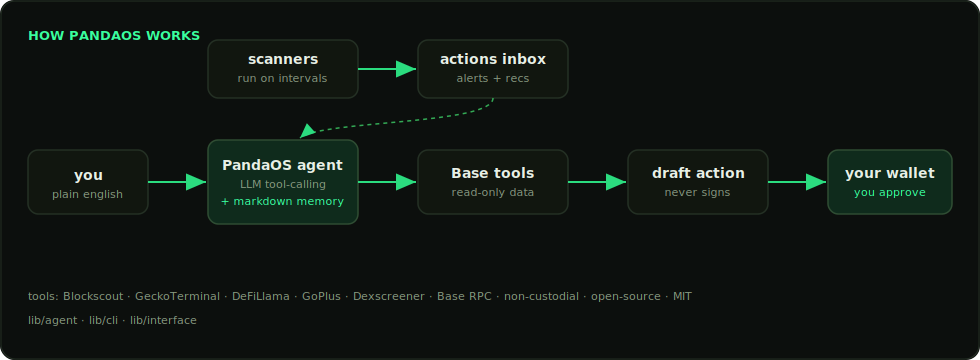
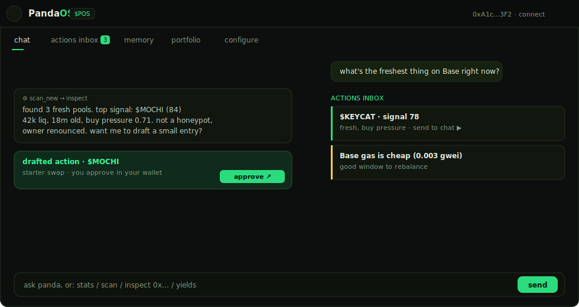

<div align="center">


# PandaOS

**The open-source, non-custodial agent terminal for [Base](https://base.org).**

[](./LICENSE)
[](https://base.org)
[](https://www.typescriptlang.org)
[]()
[]()
[](https://github.com/mycopok/panda-os/actions)





</div>

PandaOS reads on-chain data, scores opportunities, watches Base with autonomous scanners, and
**drafts** actions you approve in your own wallet. It never holds your keys. The whole agent is
open-source and self-hostable: clone it, read every line, run it yourself.

## Why

The agent layer for Base should be open. Not a black box that holds your funds, not a custodial
shortcut you have to trust. PandaOS keeps the substance (the tools, the loop, the scoring) in the
open and keeps signing in your wallet, where it belongs.

## The four systems

**1. Chat & execute.** Talk to Base in plain words. With an OpenAI-compatible key the agent does
real multi-step tool-calling; without one it falls back to a deterministic command parser. To act,
it drafts a transaction and hands it to your wallet.

**2. Action system.** Scanners run on user-set intervals over live tool data and emit two kinds of
rows: *alerts* (FYI / risk) and *recommendations* with a one-click button that feeds an imperative
back into the chat agent.

**3. Memory.** A markdown file you own (stored locally) that the agent reads before every move. It
holds your chains, risk tolerance and the protocols you avoid.

**4. Tools.** A read-only layer over public Base data. Toggle any source in configure.

| source | what it gives the agent |
|---|---|
| **Base RPC** | balances, block height, raw chain reads |
| **Blockscout** | address info, holders, token counters, verification |
| **GeckoTerminal** | new / trending pools, prices, volume, age |
| **DeFiLlama** | Base yield pools and TVL |
| **GoPlus** | token security: honeypot, taxes, mintable, owner, top holders |
| **Dexscreener** | market data, socials, pair age |

## Quickstart

Requires **Node 18+** and **pnpm**.

```bash
pnpm install
pnpm dev            # web terminal at http://localhost:5173
pnpm cli stats      # or the headless CLI
pnpm test           # unit tests
```

## Architecture

```
lib/
  agent/        the agent: tools, the agent loop, scanners, the scoring engine (unit-tested)
  cli/          a zero-dependency headless terminal (node lib/cli/src/cli.js)
  interface/    the PandaOS web terminal (chat · actions · memory · portfolio · configure)
assets/         logo + diagram
```

`lib/agent` is the brain and has no UI. `lib/cli` and `lib/interface` are two front-ends over it.
Write your own front-end or scanner against `lib/agent` and it just works.

## Security model

- **No private keys, ever.** PandaOS has no signing path. It reads and drafts; you approve in your
  own wallet (Base account / EIP-1193). It cannot move funds.
- **Your secrets stay yours.** Any LLM key and your memory file live only in your browser's local
  storage, never on a server.
- Treat every output as research. Verify before you act.

## Contributing

PRs welcome. Add a tool source, write a scanner, improve the agent loop. Keep it read-only and
non-custodial. Run `pnpm test` before opening a PR.

## Disclaimer

Experimental software. On-chain activity carries risk. You are responsible for your own wallet and
approvals.

## License

[MIT](./LICENSE). Build on it.
